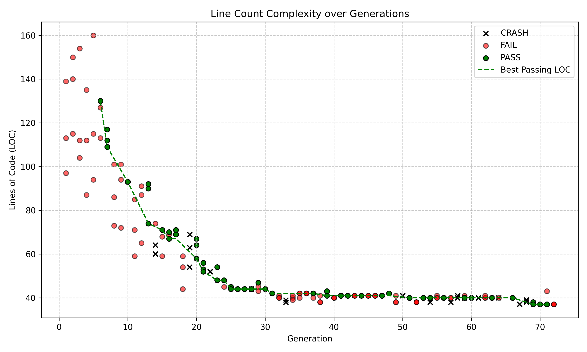
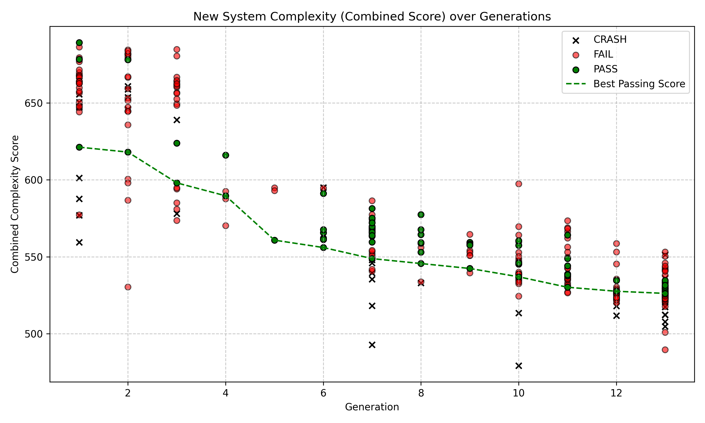

# ABM Auto-Ablation (Sugarscape)

This repository hosts an automated research program where an AI agent performs **structural ablation** on Epstein & Axtell's classic *Sugarscape* agent-based model (1996). 

## Objective

The goal of this experiment was to systematically strip away, merge, and simplify code to discover the **absolute minimal viable model** capable of reproducing the emergent macroscopic behaviors documented in the original paper. The AI was tasked with reducing complexity while strictly maintaining specific metrics within narrow error bounds:
- **Wealth Inequality** (Gini Coefficient ≈ 0.3–0.6)
- **Population Dynamics** (converging to carrying capacity)
- **Trade Price** (converging to the geometric mean of Marginal Rates of Substitution)
- **Survival Rate & Spatial Entropy**

## Results

This project unfolded in two phases, revealing how an AI optimization process adapts to different objective functions over time. While the first phase focused on raw length, the second phase shifted the optimization target while building directly on the results of the first phase.

### Phase 1: The "Code Golf" LOC Minimization (LOC Complexity Version)
In a previous version of this experiment (logged in `results LOC count.tsv`), the AI's sole objective was to minimize pure **Lines of Code (LOC)**. 
- Over 70+ attempts, the AI aggressively refactored the logic to reduce line breaks.
- It shrunk the model down to roughly **37 lines of code**. 
- **The Catch:** While it successfully optimized the LOC metric, it did so by producing extremely dense, unreadable "code golf". It heavily utilized walrus operators (`:=`), single-pass procedural loops, and aggressive tuple unpacking. It proved that complex emergence requires very little *text*, but the code's underlying structural complexity remained high. The LOC simplification was entirely driven by this specific objective, not by genuine structural simplification.

### Phase 2: Structural Simplicity (AST & Cyclomatic Complexity Version)
Recognizing that fewer lines simply resulted in denser code, the experiment shifted its optimization target away from raw LOC toward reducing **Abstract Syntax Tree (AST) nodes** and **Cyclomatic Complexity**.
- **Important Distinction:** Because this phase continued from the end state of Phase 1, it inherited the extreme "code golf" density. During this Phase 2 run, the line count remained remarkably stable (around 32-37 lines), while the AI focused on simplifying the actual *computational logic* rather than just line breaks.
- The combined complexity score (weighted sum of 40% AST nodes and 60% Cyclomatic Complexity) was successfully reduced from **678.0** down to **526.2** (a ~22.4% reduction).
- To achieve this, the AI discovered genuine mathematical optimizations. For example:
  - **Monotonic Utility Simplification:** It bypassed redundant floating-point divisions by leveraging the fact that raising utilities to a positive power of $1/M_t$ is a monotonic transformation.
  - **MRS Consolidation:** It simplified Marginal Rate of Substitution (MRS) expressions using basic algebraic identities to eliminate nested division operations.
- The result of this AST-focused system is a model that is computationally and structurally simpler. However, because it optimized strictly for AST and cyclomatic complexity while inheriting Phase 1's state, it still heavily utilized dense "code golf" tactics (like replacing objects with raw lists and using dense generator expressions). It proved that optimizing for *any* single complexity metric without readability constraints inevitably leads to highly dense, unreadable code.

## Complexity Visualizations

The two graphs below illustrate the distinct metrics tracked across the two separate runs.

### Phase 1: Line Count Complexity (Legacy Run)
This graph shows the aggressive reduction in Lines of Code (LOC) during the first experiment, where the objective was purely text-based minimization.



### Phase 2: New System Complexity (AST + Cyclomatic Score)
This graph reflects the current generation of the project. It tracks the reduction in a combined structural complexity score over 13 generations of the Phase 2 run.



Understand that these graphs have different definitions of generation. The first graph is just a count of the times the LLM was prompted. In the second each generation is counted up when a result successfully met the requirements (passed the parameter sweep and had less complexity). 

## Getting Started

If you want to explore the code, baseline metrics, or run your own tests:

1. Install the requirements:
   ```bash
   pip install -r requirements.txt
   ```
2. The core logic the AI was modifying is located in `strategy.py`.
3. The evaluation harness and metrics definitions are in `prepare.py` and `metrics.py`.
4. Read `program.md` for the full set of constraints and rules the agent operated under.

## Files Generated
- `results LOC count.tsv` and `results.tsv` contain the raw execution logs of the ablation variants.
- `plot_logs.py` was used to generate the graphs seen above.
